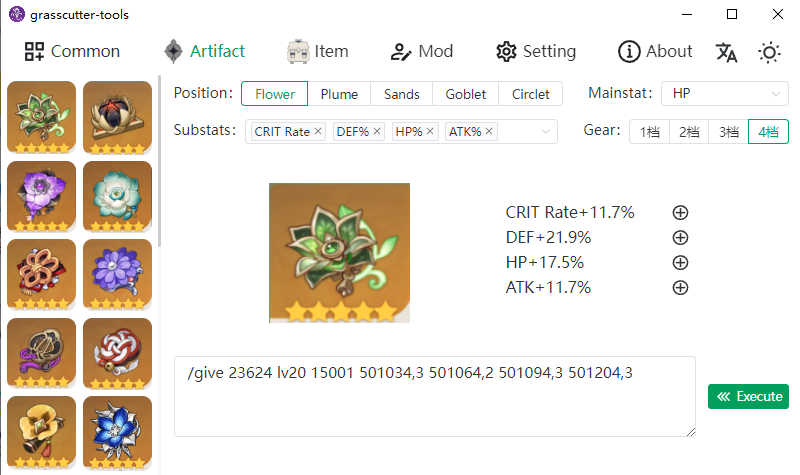
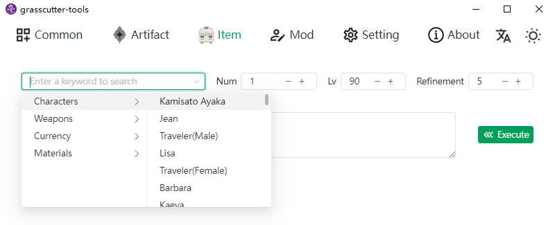
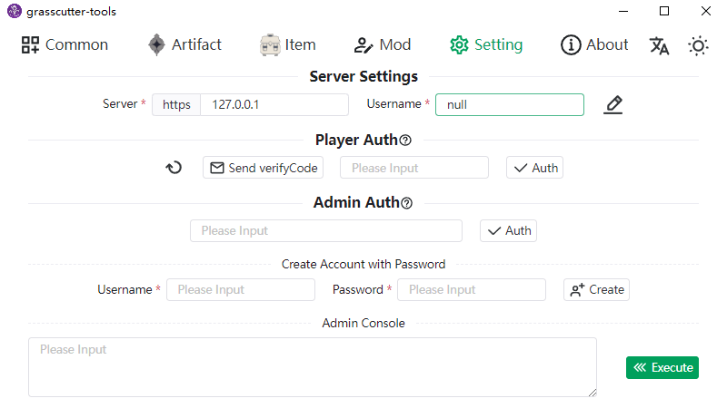

<h1 align="center">Grasscutter Tools</h1>

English | [简体中文](README_zh-CN.md)







[](https://github.com/jianxingxuejian/grasscutter-tools/blob/main/LICENSE)
[](https://github.com/jianxingxuejian/grasscutter-tools/stargazers)
[](https://github.com/jianxingxuejian/grasscutter-tools/network/members)
[](https://github.com/jianxingxuejian/grasscutter-tools/releases)
[](https://github.com/jianxingxuejian/grasscutter-tools/releases)

## Features

- [x] Common Command
- [x] Create Artifacts
- [x] Item Category Search
- [x] Spawn List
- [x] Quest/Scene/TP
- [x] Online Mod Download and Local Mod Management
- [x] Admin Console
- [ ] Launcher(TODO)

## Usage

Need to Server use with the [plugin](https://github.com/jianxingxuejian/grasscutter-plugin/releases/tag/v1.4.1).

Before you use the client, you should complete the easy certification first(send a verification code via in-game mailbox to your game to complete the verification within 1 minute or verify with the password of the game account). If you are the server owner, you can use the Server-Console on it after completing the admin certification.

About Mod please [go here](docs/mod.md).

If you have any questions or want to add features, please open an issue.

## Download

Windows platform download the msi file，mac platform download the app.tar.gz or dmg file，linux platform download the deb or AppImage file，Please [go here](https://github.com/jianxingxuejian/grasscutter-tools/releases) to download the latest version.

## Development

Build with Tauri, front-end tech stack: Vue3 + Vite3 + Typescript + Naive-ui + Unocss + Vue I18n.

**Node** and **Rust** environments are required for development, and package manager use **pnpm**.

Install dependencies：

```shell
pnpm install
```

Run：

```shell
pnpm tauri dev
```

Please go to the [Tauri](https://github.com/tauri-apps/tauri) project for more information.

## Contribute

Feel free to point out any questions about code quality, UI design, etc. It would be great if you could create a pull request.

For translations, only Simplified Chinese and English are currently available. If you want to translate to other languages or optimize your translation, please go to the src/i18n/locales folder, which lists all supported languages, and submit pr.

The game data text is parsing from [gc-res-parse](https://github.com/jianxingxuejian/gc-res-parse), and most of the data has been internationalized.
