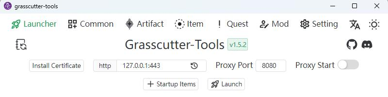
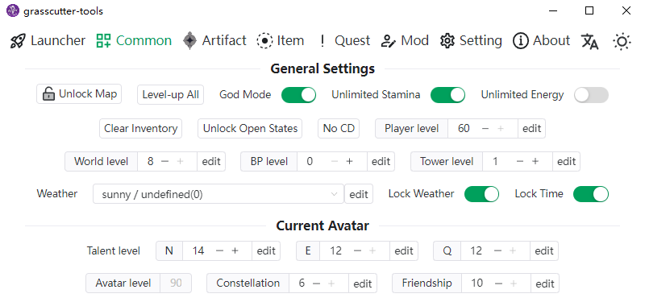
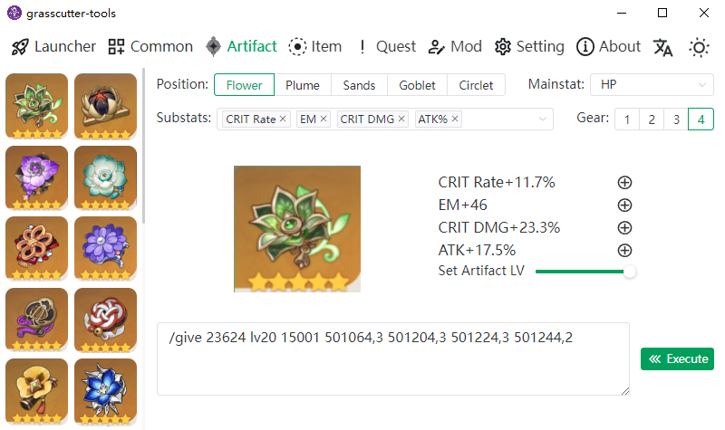
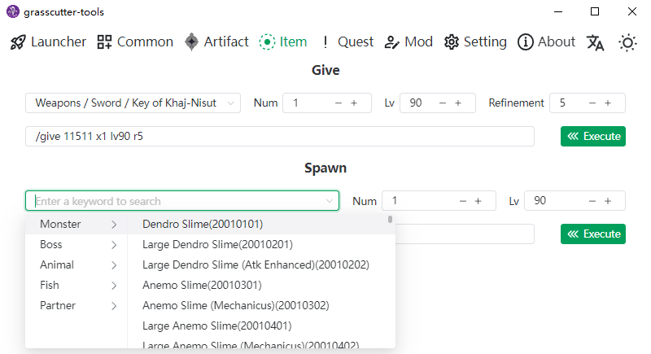
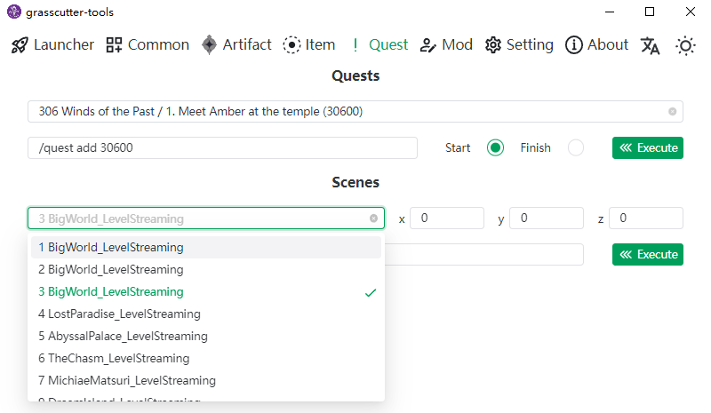
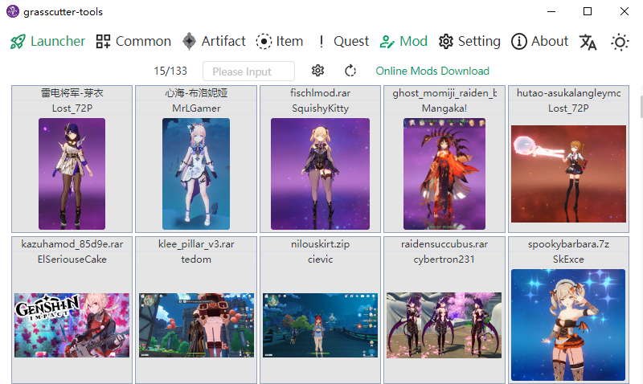

<h1 align="center">Grasscutter Tools</h1>

English | [简体中文](README_zh-CN.md)









[](https://github.com/jianxingxuejian/grasscutter-tools/blob/main/LICENSE)
[](https://github.com/jianxingxuejian/grasscutter-tools/stargazers)
[](https://github.com/jianxingxuejian/grasscutter-tools/network/members)
[](https://github.com/jianxingxuejian/grasscutter-tools/releases)
[](https://github.com/jianxingxuejian/grasscutter-tools/releases)
[](https://discord.com/invite/qGyWhAUApU)
[](https://qm.qq.com/cgi-bin/qm/qr?k=0VnTLjWPz76RSScycDyp2_X68w6b73gO&jump_from=webapi&authKey=AO4rT4mzAw8krhEVDIMECCwFX7wRmGJA9+ui7AK7aQRA3l5BCeS1h/3pXT2MCkzZ)

## Features

- [x] Launcher
- [x] Common Command
- [x] Create Artifacts
- [x] Item Category Search
- [x] Spawn List
- [x] Quest/Scene/TP
- [x] Online Mod Download and Local Mod Management
- [x] Admin Console

## Community

Join our [discord](https://discord.com/invite/qGyWhAUApU)

## Usage

If you don't want to install the client, you can use the web version that includes some of the features: https://null-grasscutter-tools.vercel.app/

The remote execute feature requires your server to use the [plugin](https://github.com/jianxingxuejian/grasscutter-plugin/releases/tag/v1.5.1).

Before you use the client, you should complete the easy certification first(send a verification code to your in-game mailbox to complete the verification within 1 minute. The new version of the plugin add a custom command, so you can also use `/verify` command to get the verification code). If you are the server owner, you can use the Admin-Console on it after completed the admin certification.

If you want to use the launcher, make sure the values of useEncryption and useInRouting in the server config.json file are both false, and then use the http address, like this: http:127.0.0.1:443, or configure the server with an https certificate, make sure the values of useEncryption and useInRouting are both true, and then you can use the https connection, like this: https:127.0.0.1

About Mod please [go here](docs/mod.md).

If you have any questions or want to add features, please open an issue.

## Download

Windows platform download the msi file，mac platform download the app.tar.gz or dmg file，linux platform download the deb or AppImage file，Please [go here](https://github.com/jianxingxuejian/grasscutter-tools/releases) to download the latest version.

## Development

Build with Tauri, front-end tech stack: Vue3 + Vite3 + Typescript + Naive-ui + Unocss + Vue I18n.

**Node** and **Rust** environments are required for development, and package manager use **pnpm**.

Install dependencies：

```shell
pnpm install
```

Run：

```shell
pnpm tauri dev
```

Please go to the [Tauri](https://github.com/tauri-apps/tauri) project for more information.

## Contribute

Feel free to point out any questions about code quality, UI design, etc. It would be great if you could create a pull request.

For translations, only Simplified Chinese and English are currently available. If you want to translate to other languages or optimize your translation, please go to the src/i18n/locales folder, which lists all supported languages, and submit pr.

The game data text is parsing from [gc-res-parse](https://github.com/jianxingxuejian/gc-res-parse), and most of the data has been internationalized.
