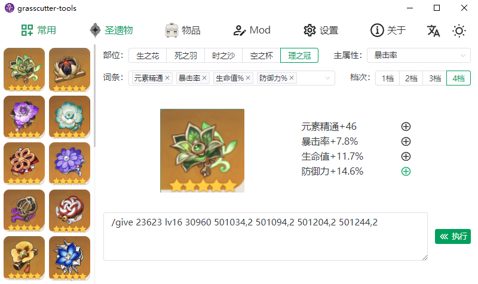
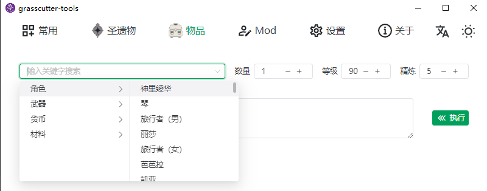

<h1 align="center">Grasscutter Tools</h1>

[English](README.md) | 简体中文






[](https://github.com/jianxingxuejian/grasscutter-tools/blob/main/LICENSE)
[](https://github.com/jianxingxuejian/grasscutter-tools/stargazers)
[](https://github.com/jianxingxuejian/grasscutter-tools/network/members)
[](https://github.com/jianxingxuejian/grasscutter-tools/releases)
[](https://github.com/jianxingxuejian/grasscutter-tools/releases)

## 功能

- [x] 常用指令
- [x] 快速生成圣遗物
- [x] 物品分类检索
- [x] Mod 管理
- [x] 管理员控制台
- [ ] 启动器(TODO)
- [ ] 天气列表(TODO)
- [ ] Mod 在线下载
- [ ] 实体列表
- [ ] 任务列表

## 使用

需要服务端配合[这个插件](https://github.com/jianxingxuejian/grasscutter-plugin/releases/tag/v1.4.1)使用。

使用客户端之前需要完成简单的账号认证(向你的游戏发送验证码邮件然后在 1 分钟之内完成验证或者用该游戏账号的密码验证)。服务端拥有者可以完成管理员认证然后使用管理员控制台，效果与服务器控制台相同。

关于 mod，请前往 [GIMI](https://github.com/SilentNightSound/GI-Model-Importer) 项目了解基础知识，本项目 mod 功能的使用方法：选择 3DMigoto Loader.exe 文件，并确保 Mods 文件夹在同一级。结构如下：

```
|-- 3DMigoto Loader.exe
|-- Mods
    |-- 刻晴
        |-- mod1
            |-- KeqingMod
                |-- Keqing.ini
                |-- ...
            |-- modinfo.json
            |-- *.png/jpg/jpeg/jfif
```

可以进行任意的嵌套和命名，但要注意每个 mod 一定要在一个单独的文件夹下，不能跟其它 mod 放在一起。程序会读取所有 mod，**自动生成 modinfo.json 文件**，然后你可以放置一张图片(与 mod 文件夹同一级)让程序读取到，也可以修改 modinfo.json 文件的 images 字段来使用网络图片。进入 mod 页面刷新下，就能看到你的所有 mod，你可以调整图片的宽高比例，填写名字和作者，然后就可以使用关键字进行筛选。mod 浮窗上的复选框是用来选择是否加载这个 mod，取消勾选时 3dm 不会加载这个 mod。

有什么疑问或者想添加功能请提 issue。

## 下载

windows 平台下载 msi 文件，mac 平台下载 app.tar.gz 或者 dmg 文件，linux 平台下载 deb 或者 AppImage 文件，请前往[此处](https://github.com/jianxingxuejian/grasscutter-tools/releases)下载最新版本。

## 开发

使用 Tauri 构建，前端技术栈：Vue3 + Vite3 + Typescript + Naive-ui + Unocss + Vue I18n。

开发需要 Node 和 Rust 环境，包管理使用 pnpm。

安装依赖：

```shell
pnpm install
```

启动：

```shell
pnpm tauri dev
```

更详细的内容请前往[Tauri](https://github.com/tauri-apps/tauri)项目进行了解。

## 贡献

欢迎任何形式的贡献！
