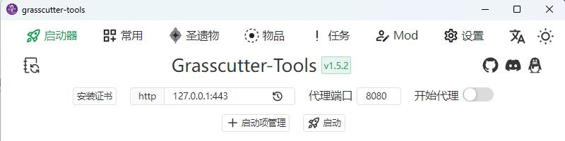
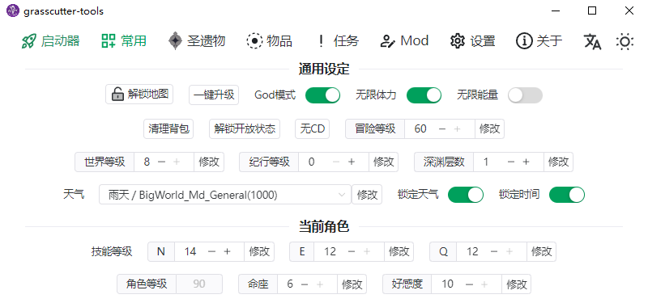
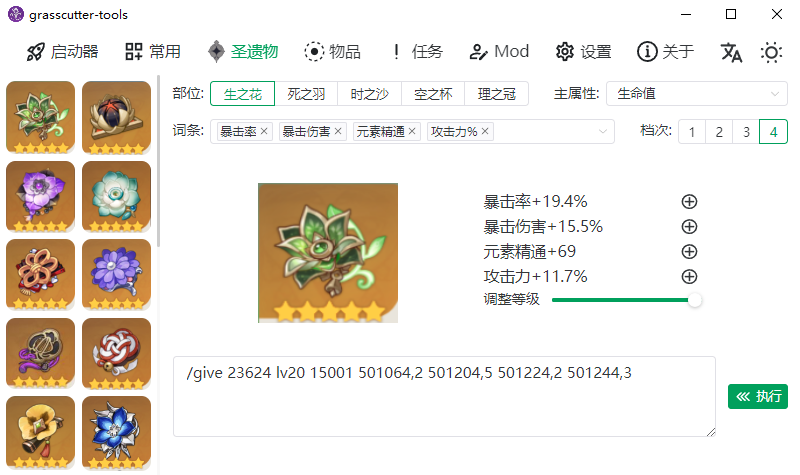
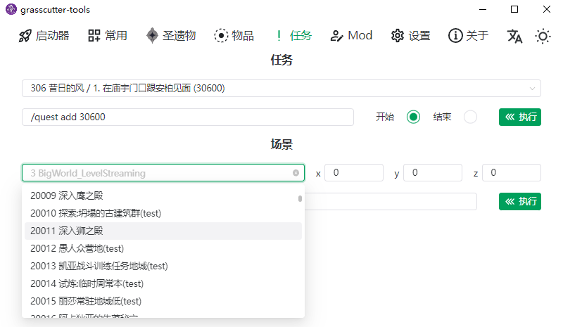
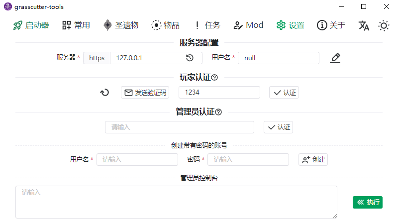

<h1 align="center">Grasscutter Tools</h1>

[English](README.md) | 简体中文










[](https://github.com/jianxingxuejian/grasscutter-tools/blob/main/LICENSE)
[](https://github.com/jianxingxuejian/grasscutter-tools/stargazers)
[](https://github.com/jianxingxuejian/grasscutter-tools/network/members)
[](https://github.com/jianxingxuejian/grasscutter-tools/releases)
[](https://github.com/jianxingxuejian/grasscutter-tools/releases)
[](https://discord.com/invite/qGyWhAUApU)
[](https://qm.qq.com/cgi-bin/qm/qr?k=0VnTLjWPz76RSScycDyp2_X68w6b73gO&jump_from=webapi&authKey=AO4rT4mzAw8krhEVDIMECCwFX7wRmGJA9+ui7AK7aQRA3l5BCeS1h/3pXT2MCkzZ)

## 功能

- [x] 启动器
- [x] 常用指令
- [x] 快速生成圣遗物
- [x] 物品分类检索
- [x] 怪物列表
- [x] 任务/场景/传送
- [x] 在线 Mod 下载和本地 Mod 管理
- [x] 管理员控制台

## 社区

加入我们的 [Discord](https://discord.com/invite/qGyWhAUApU)

加入 [QQ](https://qm.qq.com/cgi-bin/qm/qr?k=0VnTLjWPz76RSScycDyp2_X68w6b73gO&jump_from=webapi&authKey=AO4rT4mzAw8krhEVDIMECCwFX7wRmGJA9+ui7AK7aQRA3l5BCeS1h/3pXT2MCkzZ) 交流群 734643309

## 使用

如果你不想安装应用程序，可以使用包含部分功能的 web 版本: https://null-grasscutter-tools.vercel.app/

远程执行功能需要服务端配合[这个插件](https://github.com/jianxingxuejian/grasscutter-plugin/releases/tag/v1.5.1)使用。

使用客户端之前需要完成简单的账号认证(向你的游戏发送验证码邮件然后在 1 分钟之内完成验证。新版本插件新增了一个自定义指令，也可以用 `/verify` 指令获取验证码)。服务端拥有者可以完成管理员认证然后使用管理员控制台，效果与服务器控制台相同。

如果想使用启动器，请确保服务端的 config.json 文件中 useEncryption 与 useInRouting 的值都是 false，然后使用 http 地址，例如: http:127.0.0.1:443，或者服务端配置 https 证书，然后就能使用 https 连接，例如：https:127.0.0.1。

mod 相关功能的使用请看[这里](docs/mod_zh-CN.md)。

有什么疑问或者想添加功能请提 issue。

## 下载

windows 平台下载 msi 文件，mac 平台下载 app.tar.gz 或者 dmg 文件，linux 平台下载 deb 或者 AppImage 文件，请前往[此处](https://github.com/jianxingxuejian/grasscutter-tools/releases)下载最新版本。

## 开发

使用 Tauri 构建，前端技术栈：Vue3 + Vite3 + Typescript + Naive-ui + Unocss + Vue I18n。

开发需要 Node 和 Rust 环境，包管理使用 pnpm。

安装依赖：

```shell
pnpm install
```

启动：

```shell
pnpm tauri dev
```

更详细的内容请前往[Tauri](https://github.com/tauri-apps/tauri)项目进行了解。

## 贡献

欢迎指出任何关于代码质量，UI 设计等方面的问题，如果能提交 PR 就更好了。

关于翻译，目前仅有简体中文和英语。如果想要翻译其它语言或者优化翻译，请前往 src/i18n/locales 文件夹，里面罗列了所有能支持的语言版本，然后提交 pr。

游戏数据文本解析来自[gc-res-parse](https://github.com/jianxingxuejian/gc-res-parse)，大部分数据已经完成了国际化。
